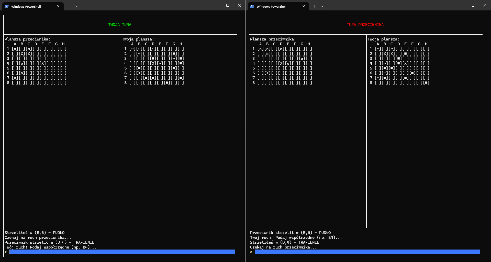

# Battleships in Go ⚓

**Battleships** is a simple Battleship game project I created to learn the Go programming language. The application consists of a gRPC server and a terminal-based client using the [`tview`](https://github.com/rivo/tview) library for a clean UI.

The game allows two players to play in real-time using bidirectional streaming. Ships are randomly placed at the start of the game, and players take turns firing shots, which are validated by the server.

---

## ✨ Technologies

- Go 1.24.2
- gRPC + bidirectional streaming
- SQLite
- Google Wire (dependency injection)
- `tview` (terminal UI)
- Protocol Buffers (protobuf)

---

## 📷 Preview



| Symbol | Meaning       |
|--------|---------------|
| ■      | Your ship     |
| X      | Hit           |
| o      | Miss          |
| ~      | Enemy miss    |


---

## 🚀 How to Run

### Server

```bash
go run ./cmd/server
```

### Client

In a separate terminal:

```bash
go run ./cmd/client
```

---

## 🧠 How It Works

- The game supports **two players** and one default game.
- Game state persists between sessions
- Additional users and games can be created using gRPC commands (no UI for this yet).
- Each player is randomly assigned **12 coordinates** where ships are placed.
- The game **does not have a win condition** – it continues indefinitely.
- If a player shoots at a previously targeted coordinate, they are notified and asked to shoot again.
